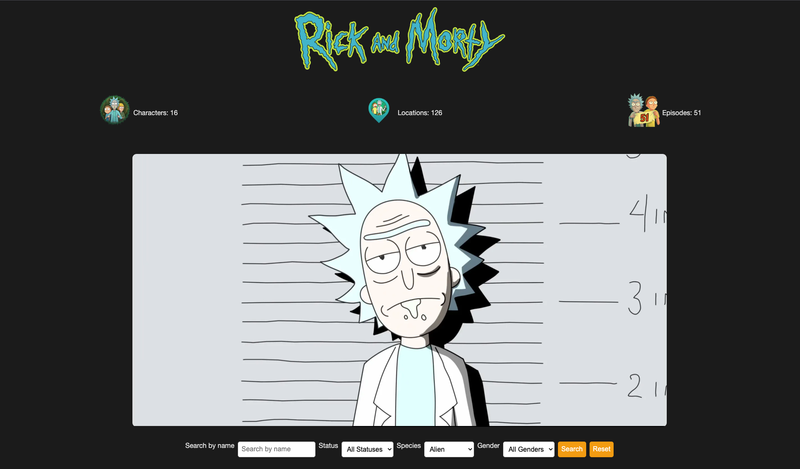

# The Rick and Morty API Web Application

This web application provides an interface to explore characters, locations, and episodes from the Rick and Morty API. Users can search and filter characters by name, status, species, and gender.

## Features

- Display a summary of characters, locations, and episodes.
- Search and filter characters by name, status, species, and gender.
- View detailed information about each character, including their status, species, last known location, and first seen episode.
- Responsive design with a visually appealing interface.

## Technologies Used

- **Python**: Backend logic and API requests.
- **Flask**: Web framework for handling routes and rendering templates.
- **HTML/CSS**: Frontend structure and styling.
- **JavaScript**: Client-side interactivity.
- **Font Awesome**: Icons for enhanced visual appeal.
- **HTTPX**: HTTP client for making API requests.
- **Flask-Caching**: Caching API responses to improve performance.

## Setup and Installation

1. **Clone the repository**:
    ```sh
    git clone https://github.com/bantoinese83/rick-and-morty-api-webapp.git
    cd rick-and-morty-api-webapp
    ```

2. **Create a virtual environment**:
    ```sh
    python -m venv venv
    source venv/bin/activate  # On Windows use `venv\Scripts\activate`
    ```

3. **Install dependencies**:
    ```sh
    pip install -r requirements.txt
    ```

4. **Run the application**:
    ```sh
    flask run
    ```

5. **Open your browser** and navigate to `http://127.0.0.1:5000` to view the application.

## Project Structure

- `app.py`: Main application file containing routes and logic.
- `templates/`: Directory containing HTML templates.
- `static/css/`: Directory containing CSS files.
- `static/assets/`: Directory containing image assets.
- `README.md`: Project documentation.

## Usage

- **Search and Filter**: Use the search bar and dropdowns to filter characters by name, status, species, and gender.
- **Pagination**: Navigate through pages of characters using the pagination links.
- **Character Details**: Click on a character card to view detailed information.
## API Endpoints

| Endpoint       | Method | Description                                      |
|----------------|--------|--------------------------------------------------|
| `/`            | GET    | Home page displaying characters, locations, and episodes summary. |
| `/character`   | GET    | Fetches characters with optional filters (name, status, species, gender). |


## Acknowledgements

- [Rick and Morty API](https://rickandmortyapi.com/)
- [Font Awesome](https://fontawesome.com/)
- [Flask](https://flask.palletsprojects.com/)

## 📊 GitHub Profile Insights

### 🚀 My GitHub Stats


---

### 💻 Top Languages


---

### 🌟 Contribution Graph


---

### 🏆 GitHub Achievements


---

### 🐙 Streak Stats


---

Feel free to explore my repositories and projects to see what I've been working on. 🚀

